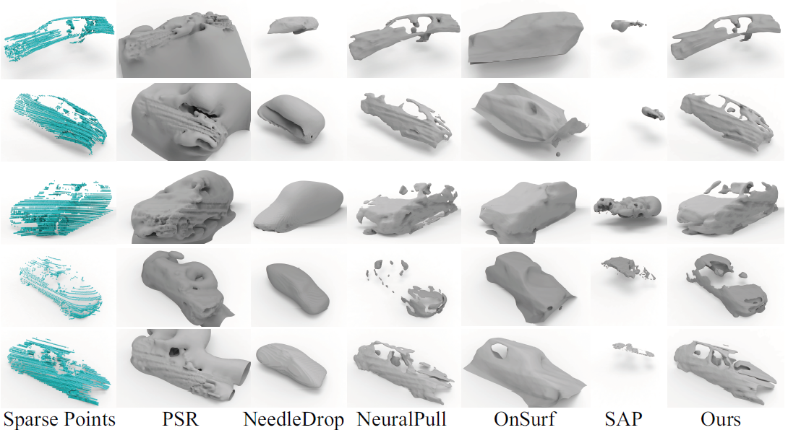
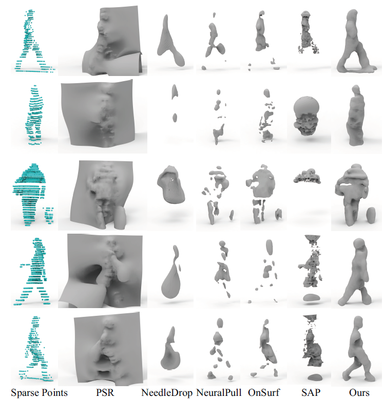

# Unsupervised Inference of Signed Distance Functions from Single Sparse Point Clouds without Learning Priors (TPAMI 2024 / CVPR 2023)

### [Project](https://chenchao15.github.io/NeuralTPS_page/) | [paper (TPAMI)](https://yushen-liu.github.io/main/pdf/LiuYS_TPAMI24_NeuralTPS.pdf) | [paper (CVPR)](https://arxiv.org/pdf/2303.14505.pdf) 

## Citation

If you find this project useful in your research, please consider citing:

```
@inproceedings{NeuralTPS,
  author = {Chao Chen and Zhizhong Han and Yu-Shen Liu},
  title = {Unsupervised Inference of Signed Distance Functions from Single Sparse Point Clouds without Learning Priors},
  booktitle = {Proceedings of the IEEE/CVF Conference on Computer Vision and Pattern Recognition (CVPR)},
  year = {2023},
}
```





## Setup

### Installation

Create virtual environment: 

```
python -m venv neuraltps_venv
source neuraltps_venv/bin/activate
```

Install dependencies:

```
pip install -r requirements.txt
```

Next, for evaluation of the models, complie the extension modules, which are provided by [Occupancy Networks](https://github.com/autonomousvision/occupancy_networks). run:

```
python setup.py build_ext --inplace
```

To compile the dmc extension, you have to have a cuda enabled device set up. If you experience any errors, you can simply comment out the `dmc_*` dependencies in `setup.py`. You should then also comment out the `dmc` imports in `im2mesh/config.py`.

Finally, for calculating chamfer distance faster during training, we use the Customized TF Operator `nn_distance`, run:

```
cd nn_distance
./tf_nndistance_compile.sh
```

## Dataset

You can download our preprocessed ShapeNet dataset. Put all folders in `data`.

You can also preprocess your own dataset by `sample.sh`, run: 

```
./sample.sh
```

## Training and Evaluation

Training and evaluating single 3d object:

```
./run.sh
```

